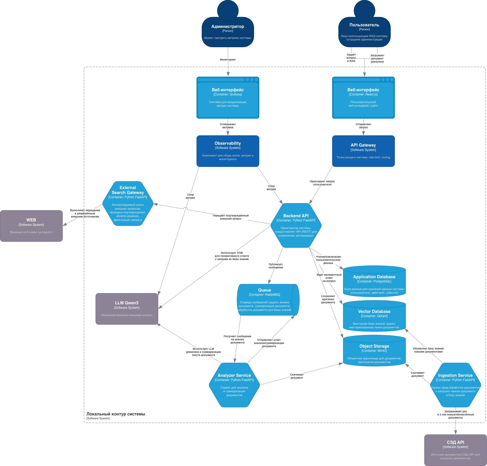

## 1. Предлагаемое решение:
Решение будет работать по принципу закрытого контура: внутренние документы, пользовательские запросы, история работы, индексы, журналы и результаты анализа не передаются во внешние облачные AI-сервисы. Генерация ответов и анализ документов выполняются локальной языковой моделью внутри инфраструктуры заказчика.
Основу решения составляет архитектура RAG: система сначала ищет релевантные фрагменты во внутренней базе знаний, затем передаёт найденный контекст локальной LLM и формирует ответ с обязательной ссылкой на документы-источники. Такой подход позволяет не просто генерировать текст, а давать пользователю проверяемый результат, пригодный для дальнейшей работы.

В состав MVP войдут:
* веб-интерфейс AI-чата для пользователей пилотной группы;
* Backend API / RAG-оркестратор для управления запросами, правами доступа, поиском и генерацией ответов;
* локальная LLM для анализа документов, суммаризации и подготовки ответов;
* векторная база данных для семантического поиска по документам;
* объектное хранилище для хранения оригиналов документов;
* база приложения для пользователей, ролей, метаданных, событий и журналов;
* сервис обработки документов для извлечения текста, анализа, разбиения на фрагменты и подготовки к индексации;
* сервис интеграции с СЭД для загрузки и обновления внутренней базы знаний;
* очередь задач для асинхронной обработки документов;
* External Search Gateway для контролируемого обращения к внешним источникам;
* контур мониторинга и метрик для контроля состояния системы и анализа эксплуатации.

Пользователь сможет задавать вопросы по внутренним документам, получать краткие и развёрнутые ответы, анализировать загруженные материалы, формировать управленческие сводки, выделять поручения, сроки, риски и проверять каждый значимый вывод по источникам.

Работа с внешними источниками будет реализована отдельно и только через подтверждение пользователя. Локальная LLM не получает прямого доступа в интернет. Если пользователю требуется использовать открытый источник, система показывает текст внешнего запроса, ожидает подтверждения и только после этого выполняет обращение через контролируемый шлюз. Все такие действия фиксируются в журнале.

## 2. Пользовательские сценарии MVP:
1. Работа с внутренней базой знаний (пользователь):
  - **_Описание сценария:_** Пользователь обращается к локальному AI-ассистенту с вопросом по внутренним документам администрации. Система выполняет поиск по подключённой базе знаний, находит релевантные фрагменты документов и формирует ответ с опорой на найденные источники.
  - **_Примеры запросов:_** Найди документы, где описан порядок рассмотрения обращений граждан. Подготовь краткую сводку по этому направлению на основании внутренней базы знаний. Какие поручения указаны в документах по этому проекту? 
  - **_Результат:_** Пользователь получает ответ, основанный на внутренних документах, с возможностью проверить источник каждого значимого вывода.
2. Анализ загруженного документа (пользователь):
  * **_Описание сценария:_** Пользователь загружает внутренний документ в систему и просит AI-ассистента выполнить его анализ: подготовить краткое содержание, выделить ключевые положения, сроки, поручения, риски или вопросы для рассмотрения.
  * **_Примеры запросов:_** Сделай краткое содержание документа. Выдели поручения, сроки и ответственных. Найди риски и спорные положения. Подготовь управленческую сводку по документу.
  * **_Результат:_** Пользователь получает структурированный анализ документа с привязкой к исходному тексту.
3. Контролируемое обращение к внешним источникам (пользователь):
  * **_Описание сценария:_** Если пользователю необходимо использовать открытую информацию из интернета, система не выполняет внешний запрос автоматически. Перед обращением к внешнему источнику AI-ассистент показывает пользователю, какой запрос планируется выполнить, и ожидает подтверждения.
  * **_Примеры запросов:_** Найди открытые материалы по аналогичным AI-платформам в органах власти. Проверь актуальную информацию по этому публичному нормативному документу. Проанализируй открытые источники по теме внедрения ИИ в муниципальном управлении.
  * **_Результат:_** Пользователь может использовать внешние источники, но при этом сохраняется контроль над тем, какие данные отправляются наружу.
4. Работа пользователя с учётом роли и прав доступа (администратор):
  * **_Описание сценария:_** Пользователь входит в систему под своей учётной записью. Доступные документы, функции и действия определяются его ролью. Это позволяет ограничить доступ к внутренним материалам и функциям системы в соответствии с полномочиями пользователя. 
  * **_Примеры ролей:_** администратор, пользователь   
  * **_Результат:_** Каждый пользователь работает только с теми данными и функциями, к которым у него есть доступ.
5. Журналирование действий и контроль использования системы (администратор):
  * **_Описание сценария:_** Все значимые действия пользователей и системы фиксируются в журнале. Это необходимо для контроля, аудита, анализа качества работы AI-ассистента и расследования возможных инцидентов.
  * **_Что может фиксироваться:_** пользователь; дата и время запроса; тип действия; текст запроса; использованные источники; факт внешнего обращения; подтверждение пользователя; результат обработки; ошибки и предупреждения.
  * **_Результат:_** Заказчик получает прозрачный механизм контроля использования AI-системы.
6. Администрирование базы знаний (администратор):
  * **_Описание сценария:_** Уполномоченный пользователь или администратор подключает документы к базе знаний, обновляет их, контролирует статус обработки и управляет доступностью материалов для пользователей.
  * **_Действия администратора:_** Администратор загружает документы или подключает источник документов. Система обрабатывает документы. Выполняется индексация и подготовка к поиску. Администратор проверяет статус обработки. При необходимости назначает права доступа. Документы становятся доступны пользователям в рамках их ролей.   
  * **_Результат:_** Внутренняя база знаний поддерживается в актуальном состоянии и используется AI-ассистентом для подготовки ответов.

## 3. Функциональные возможности:
* Локальный AI-чат
* Загрузка и подключение внутренней базы знаний
* Обработка и индексация документов
* Семантический поиск по базе знаний
* Ответы с обязательной опорой на источники
* Анализ внутренних документов
* Подготовка управленческих и аналитических материалов
* Шаблоны управленческих запросов
* Ролевая модель доступа
* Авторизация и контроль доступа
* Журналирование действий пользователей и системы
* Метрики использования и качества
* Контролируемое обращение к внешним источникам
* История запросов

*как референс продукта сервис Инфосфера округ Югра, который поддерживает:*
* работа с большими данными/документами
* расшифровка совещаний
* ответ со ссылкой на источник
* обучение пользователей работе с системой и использование для аналитики и управленческих материалов

После MVP:
- Чат-бот и обработка обращений граждан:
- ИИ-помощник в системе заявок:
- Расшифровка и конспекты совещений:
- Семантический поиск и суммаризация документов:
- Генератор типовых документов:
- Автоматическая проверка технических заданий на соотвествие законодательства и КТРУ при закупках:

поэтому в будущем сервис должен иметь вышепересчисленные функции, а также:
* видеоаналитика
* расшифровка совещений
* чат для системы заявок

## 4. Архитектура решения:

## 5. Информационная безопасность:
Решение разворачивается в локальном контуре заказчика: внутренние документы, пользовательские запросы, индексы, журналы и результаты анализа не передаются во внешние AI-сервисы. Обработка документов и генерация ответов выполняются локальной LLM внутри инфраструктуры заказчика.

Доступ к системе предоставляется только авторизованным пользователям и регулируется ролевой моделью. При формировании ответов система использует только те документы и фрагменты, к которым у пользователя есть права доступа.

Работа с внешними источниками выполняется только через External Search Gateway: внешний запрос показывается пользователю заранее и отправляется только после подтверждения. Автоматическая передача внутренних документов, служебной информации и персональных данных во внешний контур запрещена.

Все значимые действия журналируются: запросы, ответы, использованные источники, загрузка документов, внешние обращения, подтверждения пользователя, ошибки и административные действия.

Ответы AI-ассистента формируются с опорой на источники. Пользователь видит документы и фрагменты, на основании которых подготовлен ответ; при недостатке данных система сообщает об этом, а не формирует неподтверждённый вывод.

## 6. Этапы реализации:
Этап 1. Обследование и проектирование MVP 
- **Описание:** На этапе уточняются пользовательские сценарии, перечень документов базы знаний, примеры вопросов пользователя, требования к безопасности, ролям, журналированию и интеграции с СЭД. Также фиксируется архитектура MVP и состав компонентов локального контура. 
- **Результат:** согласованные требования, архитектура MVP, перечень сценариев и критерии приёмки. 

Этап 2. Развёртывание базовой инфраструктуры 
- **Описание:** В локальном контуре заказчика разворачиваются основные инфраструктурные компоненты: API Gateway, Backend API, Application Database, Object Storage, Vector Database, Queue, локальная LLM и контур Observability. 
- **Результат:** подготовленная инфраструктурная основа для разработки и запуска MVP.

Этап 3. Разработка AI-чата и пользовательского контура 
- **Описание:** Реализуются пользовательский веб-интерфейс, отправка запросов, загрузка документов, базовая авторизация, история действий, взаимодействие с Backend API и отображение результатов работы системы. 
- **Результат:** пользователь может работать с локальным AI-чатом через веб-интерфейс (без RAG).

Этап 4. Реализация RAG-контура и ответов с источниками 
- **Описание:** Настраивается обработка документов, семантический поиск по базе знаний, взаимодействие с Vector Database и локальной LLM. Система формирует ответы с указанием документов-источников. 
- **Результат:** AI-ассистент отвечает на вопросы по внутренней базе знаний с проверяемыми источниками.

Этап 5. Реализация обработки документов и интеграции с СЭД 
- **Описание:** Настраиваются Analyzer Service и Ingestion Service. Система обрабатывает документы, загруженные пользователем, а также получает и обновляет документы из СЭД через API. 
- **Результат:** внутренняя база знаний пополняется и обновляется, документы доступны для поиска и анализа.

Этап 6. Реализация контролируемого внешнего шлюза 
- **Описание:** Разрабатывается External Search Gateway. Внешние запросы выполняются только после подтверждения пользователя, проходят фильтрацию и фиксируются в журнале. 
- **Результат:** система может использовать открытые источники без неконтролируемой передачи внутренних данных наружу.

Этап 7. Мониторинг, логирование и метрики 
- **Описание:** Настраиваются журналы, технические метрики, мониторинг сервисов, сбор статистики использования и панель администратора для контроля состояния системы. 
- **Результат:** заказчик получает управляемый MVP с контролем работы, журналами и метриками.

Этап 8. Тестирование, обучение и пилотная эксплуатация 
- **Описание:** Проводится тестирование, подключение пилотной группы, обучение пользователей, проверка сценариев, сбор обратной связи и доработка системы. 
- **Результат:** рабочий MVP локального AI-ассистента, проверенный на реальных задачах, с итоговым отчётом и рекомендациями по масштабированию.

## 7. Почему наша компания:
1. Опыт построения AI-решений с RAG-архитектурой: умеем строить решения, которые принимают документы, извлекают из них текст, разбивают материалы на смысловые фрагменты, индексируют их и позволяют пользователю получать ответы с привязкой к источникам.
2. Фокус на информационной безопасности: имеем опыт проектирования и внедрения систем, где критичны закрытый контур, разграничение доступа, журналирование действий пользователей и контроль передачи данных во внешние сервисы.
3. Модульная архитектура с возможностью масштабирования: решение строится из независимых компонентов: Web UI, Backend API/RAG-оркестратор, локальная LLM, векторная база, хранилище документов, сервис обработки документов, интеграция с СЭД, внешний шлюз и мониторинг. Это позволяет развивать MVP в полноценную локальную AI-платформу.
4. Полный цикл реализации: наличие единой ответственной команды, которая понимает как техническую архитектуру, так и требования к безопасному внедрению решения.
5. Ориентация на измеримый результат: результат проекта оценивается не по факту установки модели, а по практической применимости MVP и измеримым показателям пилотной эксплуатации. В рамках проекта предусматривается сбор метрик, которые позволят заказчику объективно оценить качество, востребованность и готовность решения к масштабированию. 

## 8. Вопросы к заказчику:
1. Нужно ли сделать админку для управления администраторами базой знаний и пользователями?
